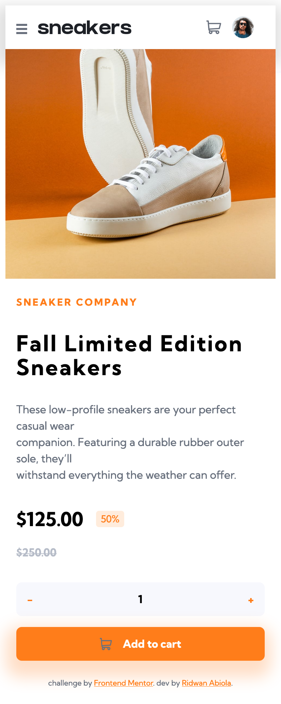

# Checkout Sneakers Store page

A personal solution to the [E-commerce product page challenge on Frontend Mentor](https://www.frontendmentor.io/challenges/ecommerce-product-page-UPsZ9MJp6). Frontend Mentor challenges help you improve your coding skills by building realistic projects.

## Table of contents

- [Overview](#overview)
  - [The challenge](#the-challenge)
  - [Screenshot](#screenshot)
  - [Links](#links)
- [My process](#my-process)
  - [Built with](#built-with)
  - [What I learned](#what-i-learned)
  - [Continued development](#continued-development)
  - [Useful resources](#useful-resources)
- [Author](#author)
- [Acknowledgments](#acknowledgments)

## Overview

Components to be used in this challenge are standard ones a user will expect on a e-commerce product showcase/checkout page.

### The challenge

Users should be able to:

- View the optimal layout for the site depending on their device's screen size
- See hover states for all interactive elements on the page
- Open a lightbox gallery by clicking on the large product image
- Switch the large product image by clicking on the small thumbnail images
- Add items to the cart
- View the cart and remove items from it

### Screenshot

### Links

## My process

I went with the vanilla way. Even though it took longer but it was worth it. I got to play around with different way doing things.

I followed these steps but still overlapped as time went by.

- Fleshed out the html
- Wrote the styles
- Added interactivity

### Built with

- Semantic HTML5 markup
- CSS custom properties
- Flexbox
- CSS Grid
- Lightbox - a library for image showcase built with jQuery.

## Author

- Website - [Ridwan](https://ridwanabiola.netlify.app/)
- Frontend Mentor - [@abu-hasib](https://www.frontendmentor.io/profile/abu-hasib)

## Acknowledgments

- Kevin Powell - Checkout [Kevin Powell's youtube](https://www.youtube.com/kepowob)
